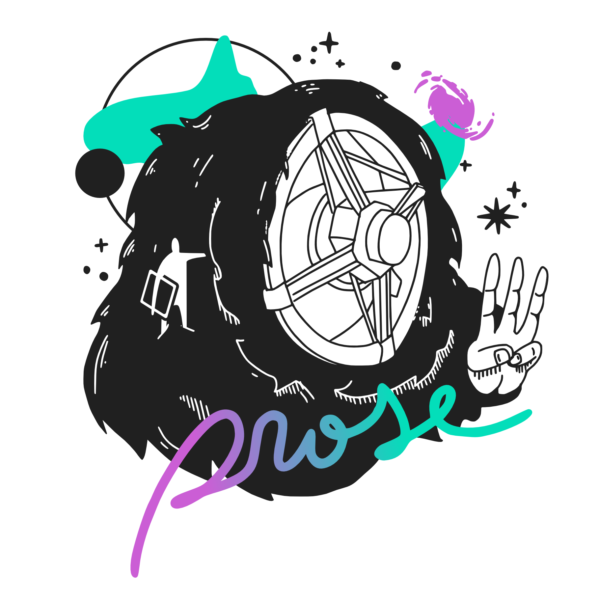

# prose

<p align="center" style="margin-bottom:-50px">
    
</p>

<p align="center">
  Modular image processing pipelines for Astronomy
  <br>
  <p align="center">
    <a href="https://github.com/lgrcia/prose">
      
    </a>
    <a href="LICENCE">
      
    </a>
    <a href="https://arxiv.org/abs/2111.02814">
      
    </a>
    <a href="https://prose.readthedocs.io/en/3.0.0">
      
    </a>
  </p>
</p>

 *prose* is a Python package to build image processing pipelines for Astronomy. Beyond featuring the blocks to build pipelines from scratch, it provides pre-implemented ones to perform common tasks such as automated calibration, reduction and photometry.

*powered by [astropy](https://www.astropy.org/) and [photutils](https://photutils.readthedocs.io)*!

## Example

Here is a quick example pipeline to characterize the point-spread-function (PSF) of an example image


```python
    import matplotlib.pyplot as plt
    from prose import Sequence, blocks
    from prose.simulations import example_image

    # getting the example image
    image = example_image()

    sequence = Sequence(
        [
            blocks.PointSourceDetection(),  # stars detection
            blocks.Cutouts(shape=21),  # cutouts extraction
            blocks.MedianEPSF(),  # PSF building
            blocks.Moffat2D(),  # PSF modeling
        ]
    )

    sequence.run(image)

    # plotting
    image.show()  # detected stars

    # effective PSF parameters
    image.epsf.params

```

While being run on a single image, a Sequence is designed to be run on list of images (paths) and provides the architecture to build powerful pipelines. For more details check [Quickstart](https://prose.readthedocs.io/en/latest/notebooks/quickstart.html) and [What is a pipeline?](https://prose.readthedocs.io/en/latest/rst/core.html)

## Installation

### latest

*prose* is written for python 3 and can be installed from [pypi](https://pypi.org/project/prose/) with:

```shell
pip install prose
```

For the latest version 

```shell
pip install 'prose @ git+https://github.com/lgrcia/prose'
```

## Contributions
See our [contributions guidelines](docs/CONTRIBUTING.md)

<p align="center">
    
</p>
