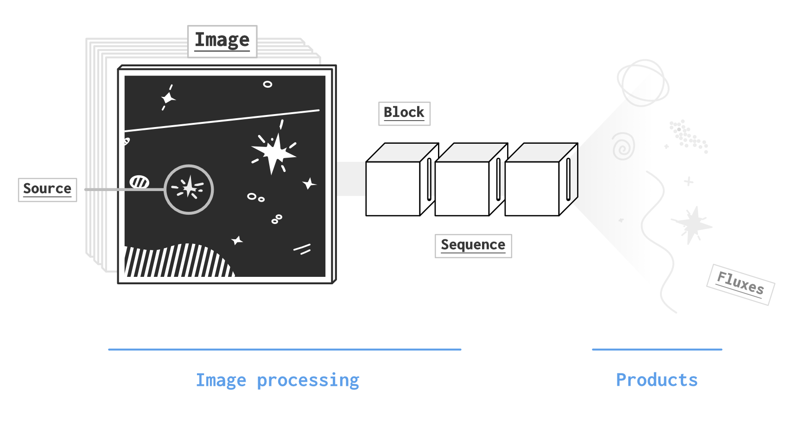

# Contributions

prose intends to be a package for image processing and stops whenever your scientific products are ready.

    

With that in mind, there are few ways to contribute to prose:
- *field-specific developments*: you want to use prose in a particular field of Astronomy (e.g. develop a new `Block` or new products)
- *core developments*: you want to make changes to prose documentation or its core objects (e.g. `Image` or `Sequence`)

## Get started

1. [fork](https://docs.github.com/en/get-started/quickstart/fork-a-repo) the github repository
2. install prose from your local fork, with `pip install -e {your_local_fork}`
3. Modify the source code, commit and push
4. Make a [pull request](https://docs.github.com/en/pull-requests/collaborating-with-pull-requests/proposing-changes-to-your-work-with-pull-requests/about-pull-requests)

## Field-specific developments

If you want to adapt prose to your own field of Astronomy (e.g. comets, exoplanets, galaxies, space debris... etc) you may want to develop a package using prose rather than making core changes. This is particularly true if you need to develop methods targeting specific products, located after the image processing (see top schematic). Even if being independent in your developments, there are few ways this could contribute to prose, and the community can help.

### Support
If you have any question about your application or need support to use prose, [open an issue](https://github.com/lgrcia/prose/issues/new?labels=idea&title=Your+idea) or [open a discussion](https://github.com/lgrcia/prose/discussions/new?category=ideas&title=My+idea). Describe your idea and potential use cases, so that users familiar with your application can help, but also agnostic contributors. Keep in mind that your idea might be worth making core changes, so users outside of your field can benefit from it.

### Acknowledgement
If you develop tools for a specific field, chances are your developments are worth a separate Python package, so that your community can benefit from your work and cite it.

If working in Academia, we strongly encourage and fully support publishing your work in the [Journal of Open Source Software](https://joss.theoj.org/), so that your package can be referenced and cited by others.

## Core developments

Core developments concern changes you want to make on the core objects of prose (e.g. `Image`, `Block` and `Sequence`). These will affect all pipelines written in prose and benefit all sort of applications. Core developments go from fixing a typo in the documentation to integrating new features.

### Submitting code
If at the idea stage, feel free to [open an issue](https://github.com/lgrcia/prose/issues/new?labels=idea&title=Your+idea) to discuss about it. If already developed, open a pull request. Whatever stage you are in, try to describe your idea to people not in your field and add a use case and code examples.

### Coding style
For core developments, here are some style guidelines we try to stick to:
- [black](https://black.readthedocs.io/en/stable/) formatting with a 88 characters line limit
- explicit variable name is preferred over comments
- extensive comments
- [numpy style](https://numpydoc.readthedocs.io/en/latest/format.html#documenting-classes) docstrings
- tests with [pytest](https://docs.pytest.org/en/7.2.x/)

No matter your level of familiarity with any of these guidelines, we can all help to make your code compliant, so feel free to propose non-formatted code.

### Acknowledgement

We intend to publish an update paper whenever a major version is released and used by the community (in order to showcase nice applications). Making core contributions (fixing typos in the documentation included) is extremely valuable and will make you part of the next paper release (a get you free stickers!).
