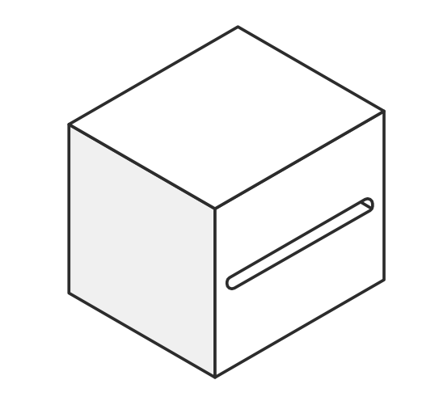
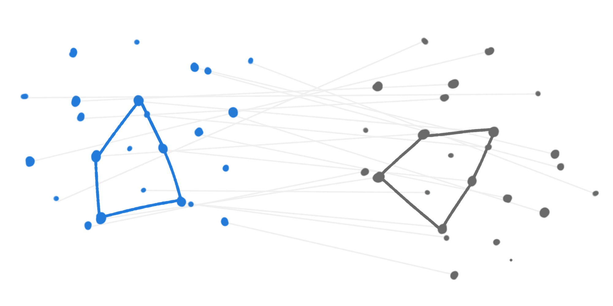

Blocks
======

A ``Block`` is a single unit of processing acting on the ``Image`` object, reading and writing its attributes. Blocks documentation include the following information:

- |read|: the ``Image`` attributes read by the ``Block``
- |write|: the ``Image`` attributes written by the ``Block``
- |modify|: indicates that the ``Image.data`` is modified by the ``Block``

Detection
---------

.. currentmodule:: prose.blocks.detection

.. autosummary::
   :template: blocksum.rst
   :nosignatures:

   PointSourceDetection
   TraceDetection
   AutoSourceDetection
   DAOFindStars
   SEDetection

PSF
---

.. currentmodule:: prose.blocks.psf

.. autosummary::
   :template: blocksum.rst
   :nosignatures:

   MedianEPSF
   Gaussian2D
   Moffat2D
   JAXGaussian2D
   JAXMoffat2D

Alignment & Geometry
--------------------

.. currentmodule:: prose.blocks

.. autosummary::
   :template: blocksum.rst
   :nosignatures:

   Trim
   Cutouts
   ComputeTransform
   
   Align
   Drizzle
   AlignReferenceSources
   AlignReferenceWCS

Centroiding
-----------

.. currentmodule:: prose.blocks.centroids

.. autosummary::
   :template: blocksum.rst
   :nosignatures:

   CentroidCOM
   CentroidQuadratic
   CentroidGaussian2D
   CentroidBallet

Photometry
----------

.. currentmodule:: prose.blocks.photometry

.. image:: ../_static/photometry.png
   :align: center
   :width: 220px

.. autosummary::
   :template: blocksum.rst
   :nosignatures:

   AperturePhotometry
   AnnulusBackground
   
Utils
-----

.. currentmodule:: prose.blocks.utils

.. image:: ../_static/utils.png
   :align: center
   :height: 190px
   
.. autosummary::
   :template: blocksum.rst
   :nosignatures:

   Get
   Calibration
   SortSources
   CleanBadPixels

All
---

.. include:: all_blocks.rst
