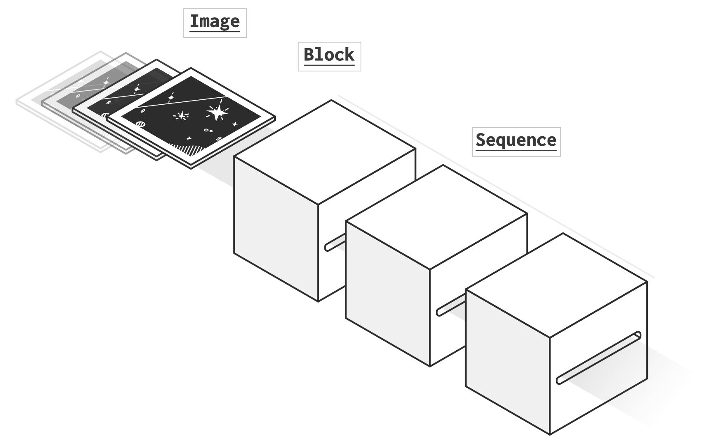

.. _core:

.. currentmodule:: prose
    
Getting started
==============

prose features three core objects that can be used to sequentialy analyze and process images: ``Image``, ``Block`` and ``Squence``

``Image``
---------

.. image:: _static/image.png
   :align: center
   :width: 280px

The ``Image`` object is self descriptive. The 2D array image itself is stored in ``Image.data`` as well as original metadata in ``Image.header``. The rest of the information can either be read or written in the object attributes.

``Block``
---------

.. image:: _static/block.png
   :align: center
   :width: 220px

A ``Block`` is a single unit of processing acting on the ``Image`` object, reading, processing and writing its attributes.

``Sequence``
------------

A ``Sequence`` is a succesion of ``Block`` intended to sequentially process a set of ``Image``. It follows three steps:

1. All *Blocks* have their :py:meth:`~prose.Block.initialize` method called
2. *Images* go succesively and sequentially through the *Blocks* :py:meth:`~prose.run` methods
3. All *Blocks* have their :py:meth:`~prose.Block.terminate` method called

Example: Hello world
--------------------

Let's have a random set of images

.. code:: python

    from prose import Image, Block, Sequence
    import numpy as np
    
    np.random.seed(42)
    images = [Image(data=np.random.rand(10,10)) for i in range(5)]

Here is a block printing hello world and the image mean

.. code:: python

    class HelloWorld(Block):
        def run(self, image):
            print(f"Hello world (mean: {np.mean(image.data):.2f})")

and running a sequence with it

.. code:: python

    sequence = Sequence([HelloWorld()], images, name="Hello world")
    sequence.run()

.. parsed-literal::

    RUN Hello world: 100%|█████████████████████| 5/5 [00:00<00:00, 15720.78 images/s

    Hello world (mean: 0.47)
    Hello world (mean: 0.50)
    Hello world (mean: 0.52)
    Hello world (mean: 0.49)
    Hello world (mean: 0.52)

.. parsed-literal::