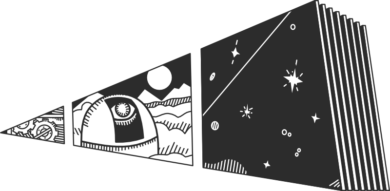

.. prose documentation master file, created by
   sphinx-quickstart on Mon Apr 27 15:15:45 2020.
   You can adapt this file completely to your liking, but it should at least
   contain the root `toctree` directive.

prose
=====

prose is a python package to reduce and analyse data from telescope observations. Its primary goal is the production of differential light curves from raw uncalibrated FITS images. prose features additional tools suited to exoplanet transit observations.

.. toctree::
   :caption: References
   :maxdepth: 1

   guide/installation
   guide/quick-ref
   guide/explore
   guide/api

.. toctree::
   :caption: Tutorials
   :maxdepth: 1

   tutorials/reduction/reduction
   tutorials/photometry-analysis/photometry-analysis
   tutorials/modular-reduction/modular-reduction

.. toctree::
   :caption: Notes
   :maxdepth: 1

   notes/phots-structure
   notes/telescope-config
   notes/blocks