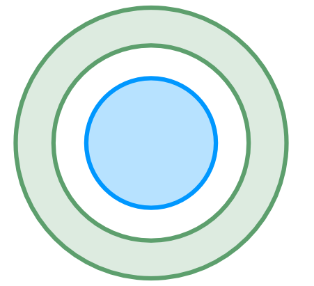

.. _note-pipeline-methods:

Pipeline methods
################

Here is a list of all options that can be used within the pipeline:

.. contents:: 
   :local:

Detection
*********
DAOFindStars
-------------

photutils_ :code:`DAOStarFinder`.

*API*: :py:class:`~prose.pipeline_methods.detection.DAOFindStars`

SegmentedPeaks
----------------
A fast detection algorithm which:

- segment the image in blobs with pixels above a certain threshold
- compute the centroids of individual blobs as stars positions

.. image:: segmentation.png
   :align: center
   :height: 260px

This method should be used when speed is required over accuracy. Uses scikit-image_.

*API*: :py:class:`~prose.pipeline_methods.detection.SegmentedPeaks`

FindPeaks
---------

Similar to :py:class:`~prose.pipeline_methods.detection.SegmentedPeaks`, implemented in photutils_.

Alignment
*********
XYShift
-------

**xyshift** is originaly the **TRAPHOT** (M. Gillon) method to align consecutive images.

*Principle*: Let's consider two images, ``im`` and ``ref``. We want to know the shift between ``im`` and ``ref`` knowing the position of the stars in these two images. We suppose that there is N stars in ``im`` and ``ref`` and that their position are given by

.. math::

   \boldsymbol{S^{im}} = \begin{bmatrix}
   x^{im}_0 & y^{im}_0 \\
   x^{im}_1 & y^{im}_1 \\
   . & . \\
   x^{im}_N & y^{im}_N
   \end{bmatrix} \quad and \quad 
   \boldsymbol{S^{ref}} = \begin{bmatrix}
   x^{ref}_0 & y^{ref}_0 \\
   x^{ref}_1 & y^{ref}_1 \\
   . & . \\
   x^{ref}_N & y^{ref}_N
   \end{bmatrix}

:math:`x_i, y_i` being the coordinates of the star :math:`i`

If we want to know, let's say, the :math:`x` shift between `im` and `ref` we just have to compute :math:`x^{im}_0 - x^{ref}_0`, or to be more accurate, by considering all the stars, the mean shift

.. math::

    \Delta x = \frac{1}{N}\sum_{0}^{N} x^{im}_i - x^{ref}_i

This is possible because :math:`x^{im}_i`  and :math:`x^{ref}_i` are the position of the same identified star :math:`i` (:math:`N` of them in each image)

Identifying stars in the sky, for example using their position with respect to constellations or by trying to match catalogs (as with astrometry.net) is possible with a single image, but is time-consuming when applied to a complete set of images. Unfortunately most of the time detected stars do not hold the same index :math:`i` (index is attributed by the star detection algorithm) and their number might differ.

The goal of **xyshift** is to check all the possible shifts from one star with respect to all the others, and to identify the most common shifts between stars of two different images.

.. image:: xyshift_principle.png

*API*: :py:class:`~prose.pipeline_methods.alignment.XYShift`

AstroAlignShift
---------------

`astroalign <https://astroalign.readthedocs.io/en/latest/>`_ is a python module used to align stellar astronomical images using 3-point asterisms (triangles) similarities. For speed, reference asterisms are computed once at the begining of the reduction and then matched with every images.

*API*: :py:class:`~prose.pipeline_methods.alignment.AstroAlignShift`

Characterization
****************

NonLinearGaussian2D
-------------------

A 2D gaussian model expressed as

.. math::   

   f(x, y) = - A \exp\left(\frac{(x-x_0)^2}{2\sigma_x^2} \frac{(y-y_0)^2}{2\sigma_y^2}\right)

is fitted from an effective psf. :code:`scipy.optimize.minimize` is used to minimize :math:`\chi ^2` from data. Initial parameters are found using the moments of the effective psf. This method is 4 times faster than :code:`photutils.centroids.fit_2dgaussian` and lead to similar results.

*API*: :py:class:`~prose.pipeline_methods.psf.NonLinearGaussian2D`

Photometry
**********

AperturePhotometry
------------------

Aperture photometry using the :code:`CircularAperture` and :code:`CircularAnnulus` of photutils_ with a wide range of apertures. By default annulus goes from 5 fwhm to 8 fwhm and apertures from 0.1 to 10 times the fwhm with 0.25 steps (leading to 40 apertures).

The error (e.g. in ADU) is then computed following:

.. math::

   \sigma = \sqrt{S + (A_p + \frac{A_p}{A_n})(b + r^2 + \frac{gain^2}{2}) + scint }

with :math:`S` the flux (ADU) within an aperture of area :math:`A_p`, :math:`b` the background flux (ADU) within an annulus of area :math:`A_n`, :math:`r` the read-noise (ADU) and :math:`scint` is a scintillation term expressed as:

.. math::

   scint = \frac{S_fd^{2/3} airmass^{7/4} h}{16T}

with :math:`S_f` a scintillation factor, :math:`d` the aperture diameter (m), :math:`h` the altitude (m) and :math:`T` the exposure time.

*API*: :py:class:`~prose.pipeline_methods.photometry.AperturePhotometry`

