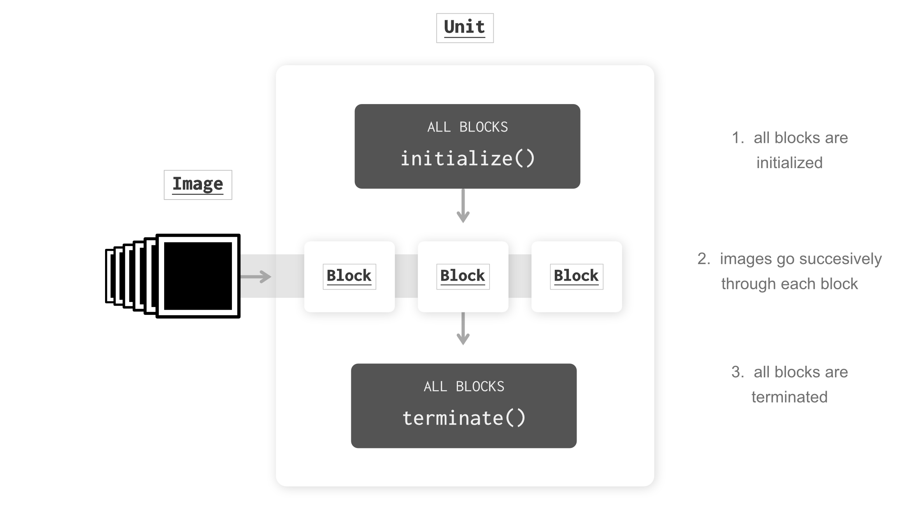
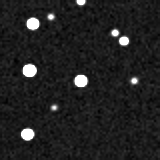
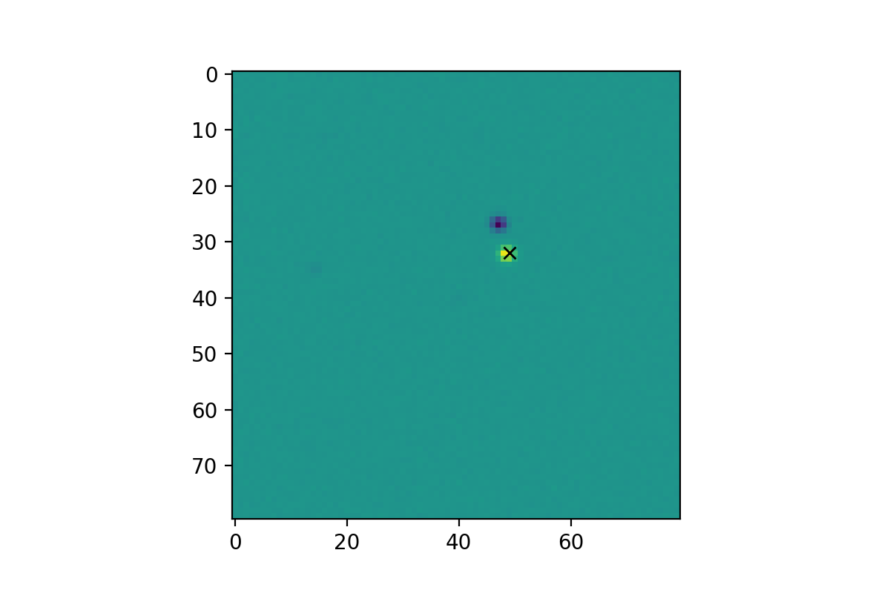
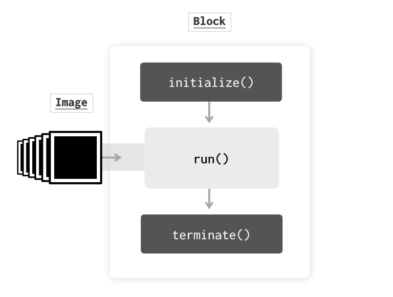
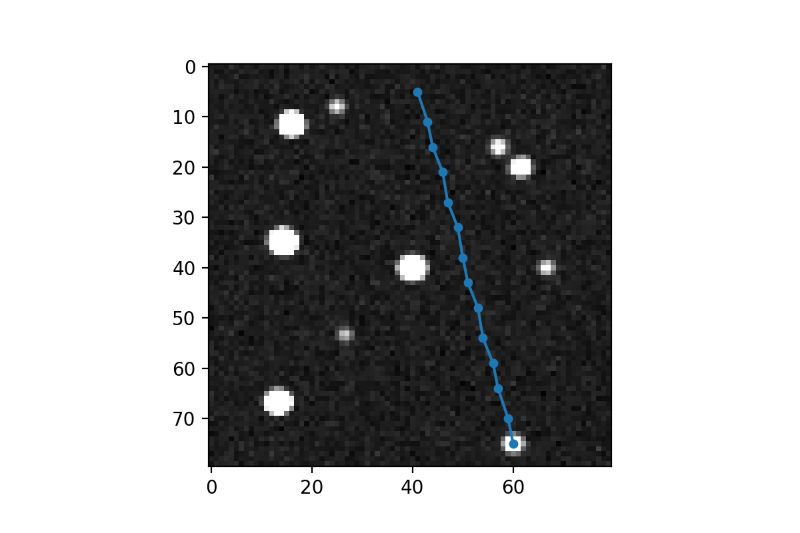

.. _modular-reduction:

.. note::

   Tutorial still under review

Modular reduction
=================

In |prose|, :py:class:`~prose.Block` objects (which are dedicated to image analysis and/or modification) can be aranged into :py:class:`~prose.Unit` which have the following workflow:

   :py:class:`~prose.Unit` hooks and data flow

By providing :ref:`many pre-implemented blocks <blocks>` one can arange a complete pipeline to achieve a specific analysis. :py:class:`~prose.Block` can also be implemented to include custom processing.

.. title:: Objective

In this tutorial we will create a custom :py:class:`~prose.Block` and include it in a pipeline which goal is to detect and trace a moving object in the following observation:

Dataset
-------
For this tutorial we will work on a synthetic observation which gif can be seen above. To generate this dataset:

.. code:: ipython3

   from prose.datasets import generate_prose_reduction_datatset

   generate_prose_reduction_datatset("moving_object_dataset", moving=[5, [0,40], [75, 60]], n_images=15)

We directly instantiate a :py:class:`~prose.FitsManager` object to explore this folder (see :ref:`explore`)

.. code:: ipython3

   from prose import FitsManager

   fm = FitsManager("moving_object_dataset")

Principle
---------
We will use difference imaging to locate the moving object. This is shown in the next code where we can see that difference between consecutive images allow to locate a moving source.

.. code:: ipython3

   import numpy as np
   from astropy.io import fits
   import matplotlib.pyplot as plt

   # loading first and second images
   files = fm.get("light")
   im0 = fits.getdata(files[5])
   im1 = fits.getdata(files[6])

   # difference image
   im_diff = im1 - im0

   # max difference position
   position = np.array(np.unravel_index(np.argmax(im_diff), im_diff.shape))[::-1]

   plt.imshow(im_diff)
   plt.plot(*position, "x", c="k")

Creating a new :py:class:`~prose.Block`
---------------------------------------
Now we can create a :py:class:`~prose.Block` that will extract and store this information. It must be a sub-class of :py:class:`~prose.Block`, i.e. 

.. code:: ipython3

   from prose import Block

   class MovingObject(Block):

      def __init__(self, **kwargs):
         super().__init__(**kwargs)
         self.last_image = None
         self.positions = []

We have added two attributes: one which stores the last image (needed to do difference with) and the other being the positions of the moving object.

As a reminder, a block has the following strucure:

   :py:class:`~prose.Block` hooks and data flow

Here we don't need to instantiate ``initialise()`` because no information is needed apart from the images. However we have to implement the ``run()`` method:

.. code:: ipython3

   # within the class
   def run(self, image):
      # For the fist image we have nothing to differentiate for
      if self.last_image is None:
         self.positions.append(None)
      else:
         im_diff = image.data - self.last_image
         position = np.unravel_index(np.argmax(im_diff), im_diff.shape)[::-1]
         self.positions.append(position)
         
      self.last_image = image.data

Finally let's instantiate the ``terminate()`` class that will simply plot the ``positions`` over the last image:

.. code:: ipython3

   from prose.utils import z_scale

   # within the class
   def terminate(self):
      plt.imshow(z_scale(self.last_image), cmap="Greys_r")
      coords_path = np.array(self.positions[1::])
      plt.plot(*coords_path.T, "-o", ms=4)

We can now place our new block in a :py:class:`~prose.Unit` and run it:

.. code:: ipython3

   from prose import Unit

   pipeline = Unit([MovingTarget()], "moving", fm)

   pipeline.run()

Although this is a simple example, this pipeline could be easily extended with :ref:`many other blocks <blocks>`, e.g. to perform image calibration and extract the photometry of the moving object.