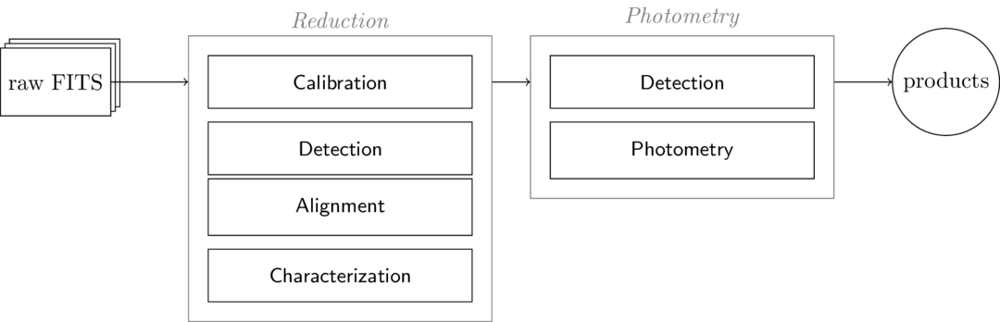

.. _modular-reduction:

Modular reduction
=================

prose modular pipeline can be described with the following diagram, constituted of two main *tasks*, *Reduction* and *Photometry*, in which *sub-tasks* are iteratively called.

All *sub-tasks* are modular as for each of them the user can choose between :ref:`several options <note-pipeline-methods>`.

Here is an example on ... TODO