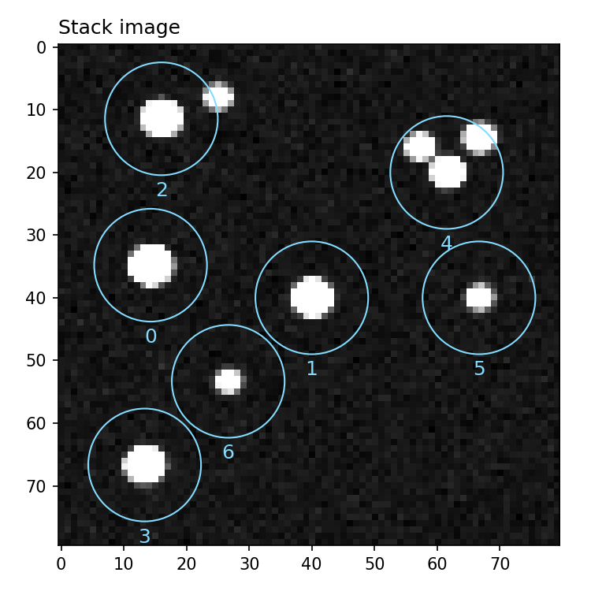
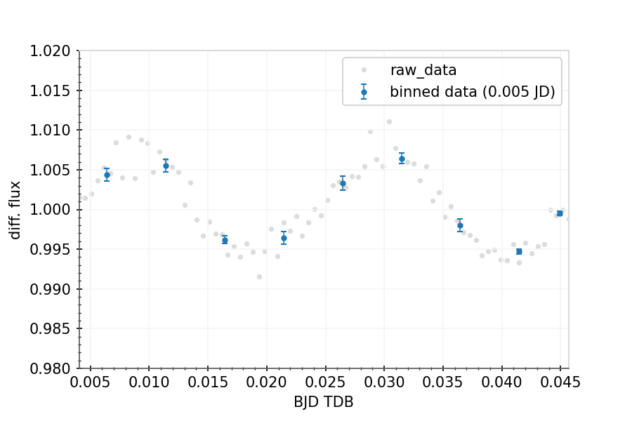
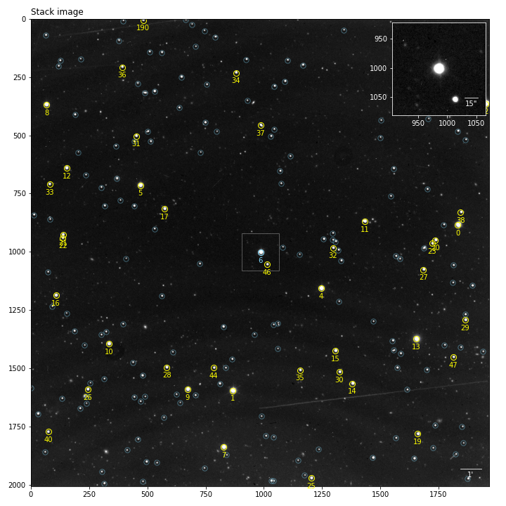

.. _photometry-analysis:

Photometry analysis
===================

In this tutorial we will see how to use and analyse photometric products from |prose|. As an example we will work from the products of the :ref:`previous tutorial <reduction>` which led to the reduced folder ``fake_telescope_20200229_prose_I+z``

Let's instantiate a :py:class:`~prose.PhotProducts`  object containing all we need for this analysis and show the detected stars

.. code-block:: python

    from prose import PhotProducts
    
    phot = PhotProducts("./fake_telescope_20200229_prose_I+z")
    phot.show_stars()

   Stack with detected stars overlaid with their ids

If target was not specified in the reduction process, we need to specify it before producing our differential Photometry.

.. code-block:: python

    phot.target_id = 1
    phot.Broeg2005()
    phot.lc.plot()

   Light curve plot. Axis labels, ylim and figure style have been set after ``plot()``

We used the Broeg 2005 algorithm and ended by plotting our light-curve. ``phot.lc`` contains a :py:class:`~prose.LightCurve` object providing convenient methods for light-curves data manipulation and plotting.

We can check the comparison stars

.. code-block:: python

    phot.show_stars(zoom=False)

   Stack with detected stars overlaid. Comparison stars are highlighted in yellow

and continue with further visualisation or analysis. All available plotting methods are described in the :ref:`quick-ref` and in details in :py:class:`~prose.PhotProducts`.

To save your analysis

.. code-block:: python

    phot.save()

