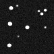
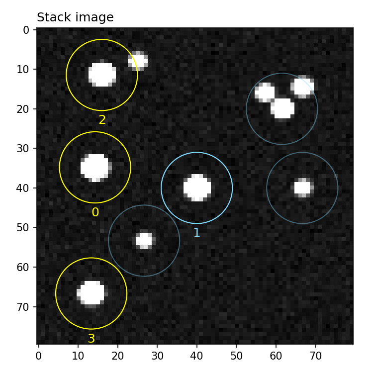

.. _reduction:

Differential photometry
========================

After an observation is done, a common need is to reduce and extract fluxes from raw FITS images. In this tutorial you will learn how to process a complete night of raw data from any telescope with some basic reduction tools provided by |prose|.

Example data
^^^^^^^^^^^^
you can follow this tutorial on your own data or generate a synthetic dataset with

.. code-block:: python3

    from prose.datasets import generate_prose_reduction_datatset

    fits_folder = generate_prose_reduction_datatset("./tutorial_dataset")

Telescope setting
^^^^^^^^^^^^^^^^^

We start by setting up the telescope information we need for the reduction, for example some fits keywords that are specific to this observatory plus few specs:

.. code-block:: python3

    from prose import Telescope

    Telescope({
        "name": "fake_telescope",
        "trimming": (0, 0),
        "latlong": [24.6275, 70.4044]
    })

.. parsed-literal::

    Telescope 'fake_telescope' saved

This has to be done **only once** and saves this telescope settings for any future use (whenever its name appears in fits headers). More details are given in the :ref:`telescope settings <telescope-config>` note.

Folder exploration
^^^^^^^^^^^^^^^^^^

The first thing we want to do is to see what is contained within our folder. For that we instantiate a :py:class:`~prose.FitsManager` object on our folder to describe its content

.. code-block:: python3

    from prose import FitsManager

    fm = FitsManager(fits_folder, depth=2)
    fm.describe("calib")

.. parsed-literal::

    ╒════════════╤════════════════╤════════╤══════════╤══════════════╤══════════╤════════════╕
    │ date       │ telescope      │ type   │ target   │ dimensions   │ filter   │   quantity │
    ╞════════════╪════════════════╪════════╪══════════╪══════════════╪══════════╪════════════╡
    │ 2020-02-29 │ fake_telescope │ bias   │          │ 80x80        │          │          1 │
    ├────────────┼────────────────┼────────┼──────────┼──────────────┼──────────┼────────────┤
    │ 2020-02-29 │ fake_telescope │ dark   │          │ 80x80        │          │          1 │
    ├────────────┼────────────────┼────────┼──────────┼──────────────┼──────────┼────────────┤
    │ 2020-02-29 │ fake_telescope │ flat   │          │ 80x80        │ I+z      │          3 │
    ├────────────┼────────────────┼────────┼──────────┼──────────────┼──────────┼────────────┤
    │ 2020-02-29 │ fake_telescope │ light  │ prose    │ 80x80        │ I+z      │         80 │
    ╘════════════╧════════════════╧════════╧══════════╧══════════════╧══════════╧════════════╛

We have 80 images of the *prose* target together with some calibration files. More info about the :py:class:`~prose.FitsManager` object :ref:`here <explore>`.

Reduction and Photometry
^^^^^^^^^^^^^^^^^^^^^^^^

|prose| provides basic pipelines for reduction and photometry. Using these, the reduction is simply

.. code-block:: python3
    
    from prose import Reduction

    reduction = Reduction(fm)
    reduction.run()

.. parsed-literal::

    RUN Reduction: 100%|█████████████████████████| 80/80 [00:05<00:00, 13.98files/s]

The previously set telescope has been recognized and a ``fake_telescope_20200229_prose_I+z`` folder has been created in which we can now run the photometry.

.. code-block:: python3

    from prose import Photometry

    photometry = Photometry(reduction.destination)
    photometry.run()

.. parsed-literal::

    INFO detected stars: 7
    INFO global psf FWHM: 2.10 (pixels)
    RUN Photometric extraction: 100%|████████████| 80/80 [00:05<00:00, 15.28files/s]

Here is the content of the reduced folder:

::

    fake_telescope_20200229_prose_I+z/
      │ 
      ├── fake_telescope_20200229_prose_I+z.phots
      ├── fake_telescope_20200229_prose_I+z_stack.fits
      ├── fake_telescope_20200229_prose_I+z_movie.gif
      ├── fake-C001-002020-03-01T00:00:00.000_reduced.fits
      ├── fake-C001-002020-03-01T00:01:00.000_reduced.fits
      ├── fake-C001-002020-03-01T00:02:00.000_reduced.fits
      └── ...

It contains all reduced images and a stack fits of the night as well as a ``phots`` file containing all extracted fluxes (see :ref:`data products description <phots-structure>`). It also contains a small gif of the night 

   *fake_telescope_20200229_prose_I+z_movie.gif*

All of these have been processed and created in ``Reduction`` and ``Photometry`` which are :py:class:`~prose.Unit` objects modularly built out of :py:class:`~prose.Block`. Such pipelines can be built from scratch and even contain custom :py:class:`~prose.Block` (like in the :ref:`next tutorial <modular-reduction>`).

Photometry analysis
^^^^^^^^^^^^^^^^^^^

We can now load this folder into a ``PhotProducts`` object and proceed with further analaysis. Let's instantiate a :py:class:`~prose.PhotProducts`  object containing all we need for this analysis and show the detected stars

.. code-block:: python

    from prose import PhotProducts
    
    phot = PhotProducts("./fake_telescope_20200229_prose_I+z")
    phot.show_stars()

.. figure:: stars_before_lc.png
   :align: center
   :width: 300

   Stack with detected stars overlaid with their ids

If target was not specified in the reduction process, we need to specify it before producing our differential Photometry.

.. code-block:: python

    phot.target_id = 1
    phot.Broeg2005()
    phot.lc.plot()

.. figure:: lc.png
   :align: center
   :width: 450

   Light curve plot. Axis labels, ylim and figure style have been set after ``plot()``

We used the Broeg 2005 algorithm to build the differential light-curve and ended by plotting it. ``phot.lc`` contains a :py:class:`~prose.LightCurve` object providing convenient methods for light-curves data manipulation and plotting.

We can check the comparison stars

.. code-block:: python

    phot.show_stars(zoom=False)

   Stack with detected stars overlaid. Comparison stars are highlighted in yellow

and continue with further visualisation or analysis. All available plotting methods are described in :py:class:`~prose.PhotProducts`.

To save your analysis

.. code-block:: python

    phot.save()

