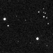

.. _reduction:

.. TODO: qatar sa mere -> qatar
.. Elsa problem document describe(files)

Reduction
=========

In this tutorial you will learn how to process a complete night of raw data from any telescope. A demo dataset can be downloaded (5Mb) here_ and consists in a very minimal observation of qatar2-b exoplanet transit observed from the Trappist-North telescope.

Telescope setting
^^^^^^^^^^^^^^^^^

We start by setting up the telescope information we need for the reduction, for example some fits keywords that are specific to this observatory plus few specs:

.. code:: python3

    from prose import Telescope, pipeline
    
    Telescope({
        "name": "NTM",
        "trimming": [40, 40],
        "pixel_scale": 0.66,
        "latlong": [31.2027, 7.8586]
    })

.. parsed-literal::

    Telescope 'ntm' saved

This has to be done only once and saves this telescope settings for any future use (whenever its name appears in fits headers)

Reduction
^^^^^^^^^

We then create a ``Reduction`` object and have a look at the folder content

.. code:: python3

    photometry_folder = "minimal_qatar2b_dataset"
    
    reduction = pipeline.Reduction(photometry_folder, deepness=2)
    reduction.describe_observations()

.. parsed-literal::

    1 observation found :
    ╒═════════╤════════════╤═════════════╤══════════╤══════════╤════════════╕
    │   index │ date       │ telescope   │ target   │ filter   │   quantity │
    ╞═════════╪════════════╪═════════════╪══════════╪══════════╪════════════╡
    │       0 │ 2020-02-29 │ NTM         │ Qatar2b  │ I+z      │         11 │
    ╘═════════╧════════════╧═════════════╧══════════╧══════════╧════════════╛

We set which observation to reduce and proceeed with reduction

.. code:: python3

    destination = "minimal_qatar2b_dataset_reduced"
    
    reduction.set_observation(0)
    reduction.run(destination)

.. parsed-literal::

    RUN: Reduction: 100%|████████████████████████| 11/11 [00:01<00:00, 10.39files/s]

and photometric extraction

.. code:: python3

    photometry = pipeline.Photometry(destination)
    photometry.run()

.. parsed-literal::

    INFO: 8 stars detected
    INFO:global psf FWHM: 4.17 (pixels)
    RUN: hotometry extraction: 100%|████████████████████████| 11/11 [00:00<00:00, 11.48files/s]

Here is the content of the ``minimal_qatar2b_dataset_reduced`` folder

::

    minimal_qatar2b_dataset_reduced/
      │ 
      ├── NTM_20200229_Qatar2b_I+z.phots
      ├── NTM_20200229_Qatar2b_I+z_stack.fits
      ├── Qatar2b-S001-R001-C001-I+z_cut_reduced.fits
      ├── Qatar2b-S001-R001-C028-I+z_cut_reduced.fits
      ├── Qatar2b-S001-R001-C055-I+z_cut_reduced.fits
      └── ...

It contains all reduced images and a stack fits of the night. The ``phots`` file is produced by the ``photometry.run`` task and contains all extracted fluxes. We can include in this folder a small gif of the night with

.. code:: python3

    pipeline.produce_gif(destination)

   *NTM_20200229_Qatar2b_I+z_movie.gif*

.. note::

    More information about reduction, photometry and how to select the methods used by the pipeline are provided in TODO

We can now load this folder into a ``Photometry`` object and proceed with further analaysis (e.g. in the :ref:`next turorial <photometry-analysis>` where we produce qatar2-b transit light-curve)